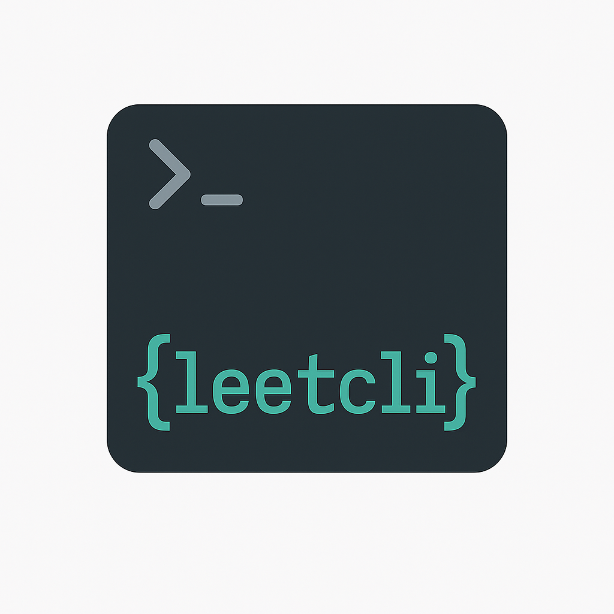

<p align="center">
  
</p>

# leetcli — A Modern LeetCode Command Line Tool

`leetcli` is a powerful and intuitive command-line tool built in **C++17** that allows you to interact with LeetCode directly from your terminal. Whether you're preparing for interviews or grinding through problems, `leetcli` makes the process faster and more developer-friendly.

## 🚀 Features

- 📝 **Fetch problems** (including the daily question)
- 🧠 **AI-powered analysis** (runtime complexity + hints via Gemini)
- 💻 **Edit solutions in your preferred language** (C++, Python, Java)
- ✅ **Run solutions remotely on LeetCode** with real test cases
- 📤 **Submit solutions** directly from the CLI
- 📂 **Organized project structure** with per-problem folders
- 🔑 **Session management** for authenticated actions

## 🏁 Quick Start

### Download Pre-built Binary (Recommended)

1. Go to the [Releases page](https://github.com/d3kanesa/leetcli/releases)
2. Download the ZIP for your platform:
   - **Windows:** `leetcli-windows.zip`
   - **macOS:** `leetcli-macos.zip`
   - **Linux:** `leetcli-linux.zip`
3. Extract the ZIP file
4. Run the binary:
   - **Windows:** `leetcli.exe`
   - **macOS/Linux:** `./leetcli`
5. (Windows) Add the binary to your PATH for global use

---

## 🔨 Build from Source

### Prerequisites

- **CMake** (3.14 or higher)
- **Git**
- **C++17 compatible compiler**
  - Windows: Visual Studio 2019/2022 or Build Tools
  - Linux: GCC 7+ or Clang 5+
  - macOS: Xcode Command Line Tools
  
### MacOS/Linux Build Instructions
  1. **Install prerequisites**:
   ```sh
   # Install Homebrew if you don't have it
   /bin/bash -c "$(curl -fsSL https://raw.githubusercontent.com/Homebrew/install/HEAD/install.sh)"
   
   # Install CMake
   brew install cmake
   ```

2. **Set up vcpkg from GitHub**:
   ```sh
   # Clone vcpkg to a permanent location
   git clone https://github.com/Microsoft/vcpkg.git ~/vcpkg
   
   # Set the VCPKG_ROOT environment variable
   echo 'export VCPKG_ROOT="$HOME/vcpkg"' >> ~/.zshrc
   source ~/.zshrc
   
   # Bootstrap vcpkg
   cd ~/vcpkg
   ./bootstrap-vcpkg.sh
   ```

3. **Clone the repository**:
   ```sh
   git clone https://github.com/d3kanesa/leetcli.git
   cd leetcli
   ```

4. **Install dependencies**:
   ```sh
   vcpkg install cpr nlohmann-json
   ```

5. **Build and install**:
   ```sh
   cmake -S . -B build -DCMAKE_TOOLCHAIN_FILE=$VCPKG_ROOT/scripts/buildsystems/vcpkg.cmake
   cmake --build build --target install
   ```
   
   **Alternative installation to user directory**:
   ```sh
   cmake --install build --prefix ~/.local
   echo 'export PATH="$HOME/.local/bin:$PATH"' >> ~/.zshrc
   source ~/.zshrc
   ```

6. **Test the installation**:
   ```sh
   leetcli --help
   ```

### Windows Build Instructions

#### 1. Clone the Repository
```bash
git clone https://github.com/d3kanesa/leetcli.git
cd leetcli
```

#### 2. Install vcpkg and Dependencies
```cmd
git clone https://github.com/microsoft/vcpkg.git
cd vcpkg
bootstrap-vcpkg.bat
vcpkg.exe install cpr nlohmann-json --triplet x64-windows-static
cd ..
```

#### 3. Configure and Build
```cmd
mkdir build
cd build
cmake .. -DCMAKE_TOOLCHAIN_FILE=../vcpkg/scripts/buildsystems/vcpkg.cmake -DVCPKG_TARGET_TRIPLET=x64-windows-static -DCMAKE_BUILD_TYPE=Release
cmake --build . --config Release --target install
```

#### 4. Install (Optional)

**System-wide installation:**
```bash
sudo cmake --install . --prefix /usr/local
```

**User installation:**
```bash
cmake --install . --prefix ~/.local
echo 'export PATH="$HOME/.local/bin:$PATH"' >> ~/.bashrc
source ~/.bashrc
```

---

## ⚡ Usage

```bash
leetcli init                        # Initialize the problems directory
leetcli fetch slug [--lang=...]     # Fetch a problem by slug or use 'daily'
leetcli solve slug [--lang=...]     # Open the solution file in your default editor
leetcli list                        # List all fetched problems
leetcli login                       # Set your LEETCODE_SESSION and CSRF token
leetcli run slug [--lang=...]       # Run your solution against LeetCode testcases
leetcli submit slug [--lang=...]    # Submit your solution to LeetCode
leetcli runtime slug [--lang=...]   # Analyze time/space complexity using Gemini
leetcli hint slug [--lang=...]      # Ask Gemini for a helpful hint
leetcli hints slug                  # Get hints for the given problem
leetcli topics slug                 # Get topics for the given problem
leetcli config set-gemini-key key   # Set your Gemini API key
leetcli help                        # Show this help message
```

## 🧠 Example: Runtime Analysis

```bash
leetcli runtime two-sum
```

Sample output:
```
  Time:  O(n)
  Space: O(n)
```

## 🔧 Initialization

Run `init` once at the root of your development folder:
```bash
leetcli init
```

This command sets up your `leetcli` workspace:
- Creates a `problems/` folder in the current directory to store fetched problems
- Asks you to choose your preferred programming language (`cpp`, `python`, `java`)
- Saves configuration in a `.leetcli_config.json` file

## 🔑 Authentication

To enable features like problem submission and test running, you'll need to authorize your LeetCode session:

```bash
leetcli login
```

You'll be prompted to enter your LeetCode session token and CSRF token, which are stored securely for future use.

## 🛠️ Configuration

To set your Gemini API key for AI-powered features:
```bash
leetcli config set-gemini-key <your-gemini-key>
```

## 🛡️ Security & Antivirus

- All official releases are built automatically and may be flagged by some antivirus software as "unknown publisher" or "rare file." This is a false positive common to unsigned open source binaries.
- If you built the binary yourself or downloaded it from the official releases page, it is safe to use.

## 🤝 Contributing

Pull requests are welcome! For major changes, please open an issue first to discuss what you would like to change.

## 📄 License

MIT License 
